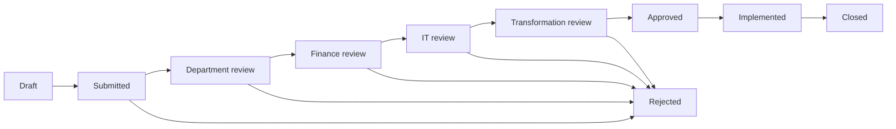

# Enterprise Workflow Approval Lab

Synthetic public showcase for enterprise workflow design, role-based approvals, auditability, and delivery governance.

This repository demonstrates how a business workflow can be translated into a small, testable software model: clear states, named roles, approval gates, audit events, and implementation handover. It is intentionally employer-neutral and uses demo data only.

## What This Proves

| Capability | Evidence in this repo |
| --- | --- |
| Digital transformation | Converts a manual business request into a controlled workflow model. |
| Enterprise systems delivery | Models cross-functional approvals around systems, finance, risk, and implementation. |
| Technical programme delivery | Uses states, decision logs, release gates, and closure discipline. |
| Governance and auditability | Records every submission, approval, rejection, implementation, and closure event. |
| Software engineering foundations | Provides a small Python package, CLI demo, tests, CI, and documented architecture. |

## Demo Scenario

The sample workflow is a synthetic operational request:

> A business team requests a procurement-to-payment reporting improvement that touches workflow configuration, finance review, IT assessment, and transformation approval before implementation.

No employer data, client data, credentials, salary/legal information, recruiter material, or private planning records are included.

## Workflow At A Glance



## Role Model

| Stage | Required role | Decision focus |
| --- | --- | --- |
| Department review | `department_owner` | Business need, ownership, readiness, adoption impact. |
| Finance review | `finance_controller` | Budget, value, risk exposure, commercial implications. |
| IT review | `it_reviewer` | Systems impact, security, data, integration, supportability. |
| Transformation review | `transformation_lead` | Delivery fit, governance, prioritisation, implementation plan. |

## Repository Map

| Path | Purpose |
| --- | --- |
| `enterprise_workflow_lab/` | Workflow models, policy rules, state engine, and CLI entry point. |
| `examples/` | Synthetic request data and a runnable demo script. |
| `tests/` | Unit tests covering happy path, role enforcement, rejection, and audit events. |
| `docs/architecture.md` | Architecture and domain model notes. |
| `docs/portfolio-context.md` | How the project maps to the public portfolio story. |
| `.github/workflows/ci.yml` | GitHub Actions workflow for test automation. |

## Quick Start

```bash
python -m unittest discover -s tests
python -m enterprise_workflow_lab demo
python -m enterprise_workflow_lab validate examples/workflow_request.json
```

Expected demo result:

```text
Request EWF-2026-001 closed after 8 audit events.
```

## Design Principles

- Make workflow status visible instead of buried in email or chat.
- Separate role permission from personal identity so the model remains portable.
- Keep every state transition auditable.
- Treat approval as a decision with rationale, not just a checkbox.
- Keep implementation and closure separate so delivery does not end at approval.

## Intentional Limits

This is a portfolio-safe demonstration, not a production workflow platform. It does not include authentication, persistence, API endpoints, background jobs, notifications, or UI screens. Those would be natural next steps, but adding them here would distract from the core proof: business workflow modelling, governance, and testable delivery logic.

## License

MIT. The sample data is synthetic and may be reused as a reference pattern.
