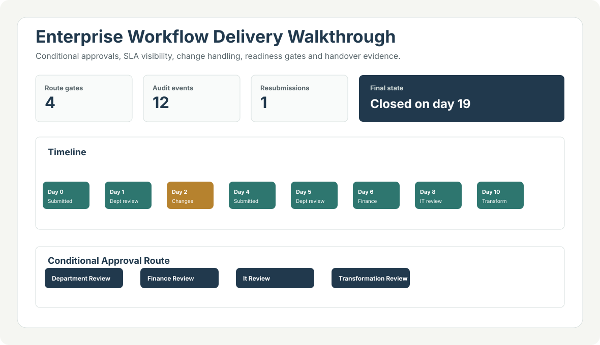
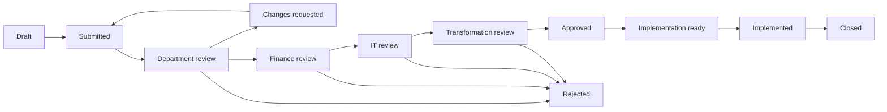

# Enterprise Workflow Approval Lab

[](https://github.com/mypoorbrain/enterprise-workflow-approval-lab/actions/workflows/ci.yml)

Portfolio-safe enterprise delivery showcase: a synthetic workflow request moves through conditional approvals, change handling, SLA visibility, implementation readiness and handover closure.

This repository is intentionally small, but it is no longer just a linear state-machine sample. It demonstrates how delivery governance can become executable: request class determines route, each gate requires the right role, decisions carry rationale and conditions, overdue stages can escalate, and implementation cannot be marked complete until readiness evidence exists.



## 60-Second Review Path

1. Open [`artifacts/workflow-walkthrough.html`](artifacts/workflow-walkthrough.html) for the visual walkthrough.
2. Scan [`artifacts/request-brief.md`](artifacts/request-brief.md), [`artifacts/decision-log.md`](artifacts/decision-log.md) and [`artifacts/readiness-checklist.md`](artifacts/readiness-checklist.md).
3. Inspect [`enterprise_workflow_lab/engine.py`](enterprise_workflow_lab/engine.py) and [`enterprise_workflow_lab/policies.py`](enterprise_workflow_lab/policies.py) for the rules.
4. Run `python -m unittest discover -s tests` to verify conditional paths and safeguards.

## Business Problem

Enterprise workflow requests often get approved in email, chat or meetings without a clear answer to:

- who is allowed to approve this stage;
- whether the request needs finance, IT or transformation review;
- what changed after review feedback;
- whether a stage is aging past SLA;
- whether implementation is actually ready;
- what evidence exists for closure.

This lab turns that governance problem into a small, testable model.

## Showcase Scenario

`EWF-2026-001` is a synthetic procurement-to-payment reporting improvement touching workflow, reporting and finance. Because it is high value, moderate risk and system-impacting, it routes through:



The generated scenario closes on **business day 19**, after **12 audit events**, **5 approval decisions**, **1 resubmission** and **4 readiness checks**.

## Delivery Artifacts

| Artifact | Purpose |
| --- | --- |
| [`artifacts/workflow-walkthrough.html`](artifacts/workflow-walkthrough.html) | Screenshot-worthy visual timeline with route, SLA status, decisions and readiness gates. |
| [`artifacts/request-brief.md`](artifacts/request-brief.md) | Requirements-style summary for the same synthetic request. |
| [`artifacts/raid-log.md`](artifacts/raid-log.md) | Risk, assumption, issue and dependency view tied to the scenario. |
| [`artifacts/decision-log.md`](artifacts/decision-log.md) | Approval rationale, outcomes and conditions. |
| [`artifacts/readiness-checklist.md`](artifacts/readiness-checklist.md) | UAT, rollback, handover and support readiness evidence. |
| [`artifacts/handover-record.md`](artifacts/handover-record.md) | Closure record after implementation. |

## What This Proves

| Capability | Evidence |
| --- | --- |
| Enterprise workflow design | Conditional route policies based on request class, value, risk and impacted systems. |
| Technical programme delivery | Request brief, RAID view, decision log, readiness checklist and handover record. |
| Governance and auditability | Every transition records actor, role, action, rationale and business day. |
| Exception handling | Change request and resubmission path, plus terminal rejection safeguards. |
| SLA and escalation thinking | Stage age, SLA days, overdue/watch/escalate status and negative tests. |
| Engineering hygiene | Python package, CLI, generated artifacts, tests, CI, `.gitignore` and MIT license. |

## Quick Start

```bash
python -m enterprise_workflow_lab demo
python -m enterprise_workflow_lab build
python -m enterprise_workflow_lab validate examples/workflow_request.json
python -m unittest discover -s tests
```

Expected demo result:

```text
Request EWF-2026-001 closed after 12 audit events.
```

## Repository Map

| Path | Purpose |
| --- | --- |
| `enterprise_workflow_lab/` | Models, policy rules, workflow engine, scenario and artifact builder. |
| `artifacts/` | Generated visual walkthrough and delivery/governance artifacts. |
| `examples/` | Synthetic request payload and runnable scenario script. |
| `tests/` | Unit tests for routes, roles, change handling, readiness, SLA and terminal states. |
| `docs/` | Architecture, preview image, backlog and portfolio context. |

## Privacy Boundary

This repository contains no employer data, client records, personal contact data, credentials, private planning records or production workflow exports. The scenario is synthetic and employer-neutral.

## Intentional Limits

This is a portfolio proof, not a production workflow platform. It does not include authentication, persistence, API endpoints, background jobs or notifications. Those would be natural production extensions, but they are intentionally excluded so the governance model remains easy to review.

## License

MIT. The sample data and generated artifacts are synthetic and may be reused as reference patterns.
