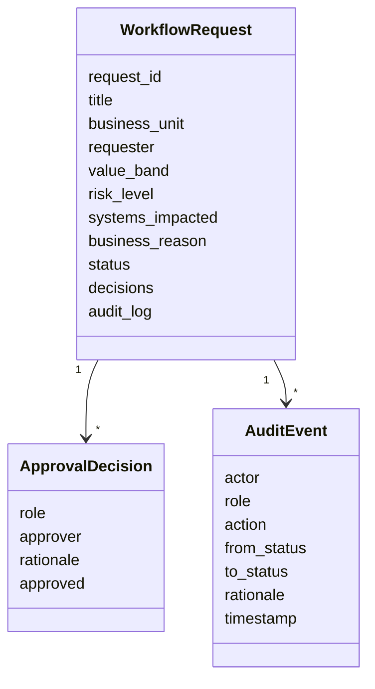

# Architecture Notes

The lab is intentionally small. It focuses on the part of transformation work that often becomes unclear in real delivery: who can approve what, what state the request is in, what evidence was captured, and when implementation is genuinely complete.

## Domain Model

## Core Components

| Component | Responsibility |
| --- | --- |
| `models.py` | Defines request, decision, audit, role, and status objects. |
| `policies.py` | Defines the approval gates and required roles. |
| `engine.py` | Applies workflow transitions and records audit events. |
| `cli.py` | Provides a small runnable demo and JSON validation command. |

## State Transition Rules

- A requester submits a draft.
- A department owner starts review.
- Each approval gate requires a specific role.
- A rejection moves the request to a terminal rejected state.
- Approval and implementation are separate states.
- Closure requires transformation lead confirmation after implementation.

## Why This Shape

The architecture keeps policy separate from execution. That makes it easier to explain the workflow to business stakeholders, test the control points, and extend the model later with persistence, notifications, APIs, or a user interface.
