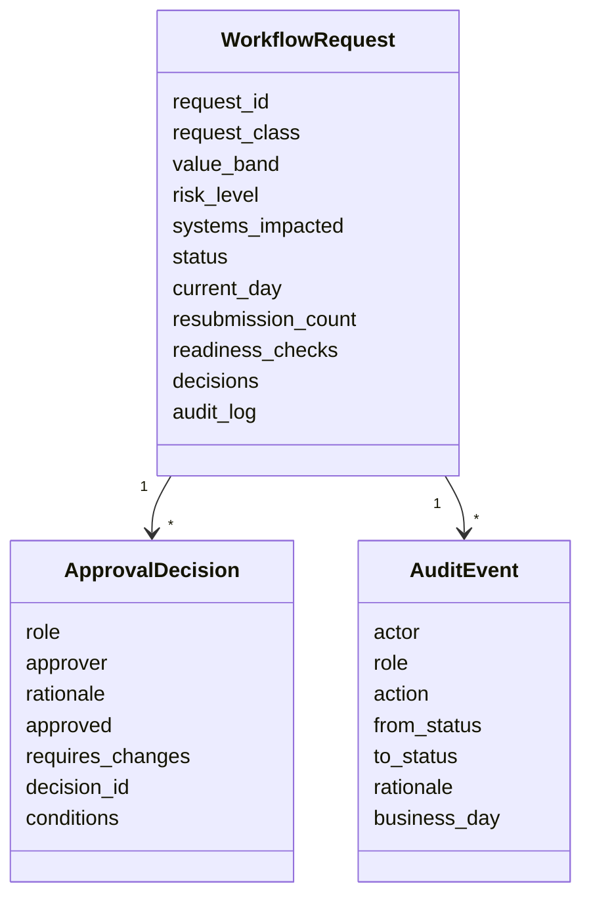

# Architecture Notes

The lab focuses on the part of transformation work that often becomes unclear in real delivery: who can approve what, which route applies, what changed after review, whether a stage is aging, and when implementation is genuinely ready.

## Domain Model

## Core Components

| Component | Responsibility |
| --- | --- |
| `models.py` | Request, role, status, decision and audit-event objects. |
| `policies.py` | Conditional approval routes, required roles, readiness checks and SLA thresholds. |
| `engine.py` | Transition rules, role enforcement, change handling, readiness gate, closure and SLA snapshots. |
| `scenarios.py` | Single synthetic portfolio scenario used by CLI, tests and artifacts. |
| `artifacts.py` | Generates the HTML walkthrough, markdown delivery artifacts, JSON summary and SVG preview. |
| `cli.py` | Runs the scenario, builds artifacts and validates request JSON. |

## Conditional Route Logic

The approval route is determined from request class, value band, risk level and impacted systems:

- department review is always required;
- finance review is required for medium/high value or controlled/procurement changes;
- IT review is required when systems are impacted;
- transformation review is required for moderate/high risk, high value, cross-functional or controlled changes.

## Safeguards

- Rejection is terminal.
- Change requests are not terminal; they require requester resubmission.
- Role mismatches raise workflow errors.
- Business day cannot move backwards.
- Implementation requires all readiness checks to pass first.
- Closure requires transformation lead confirmation after implementation.

## Artifact Lineage

`scenarios.py` -> `WorkflowEngine` -> `artifacts/workflow-summary.json` -> generated markdown/HTML/SVG artifacts.

All generated artifacts use the same synthetic request, so the visual walkthrough, decision log, RAID view, readiness checklist and handover record tell one coherent delivery story.
